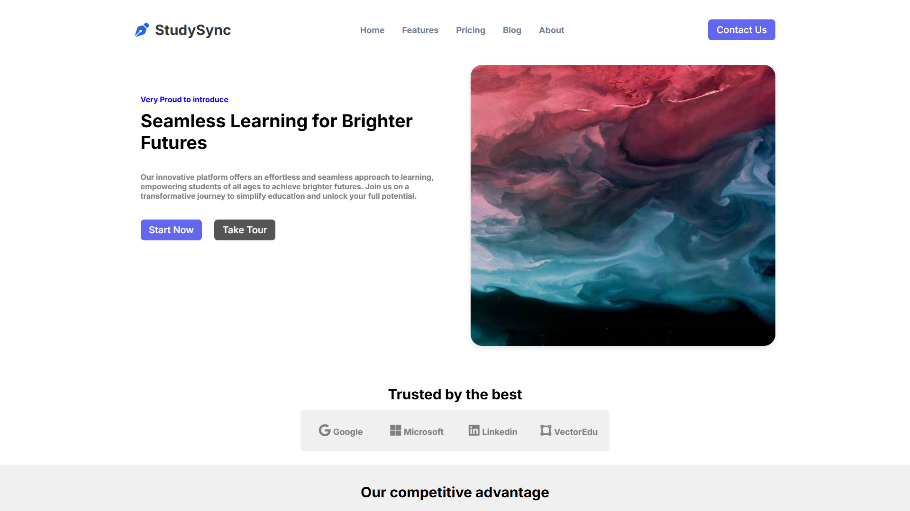
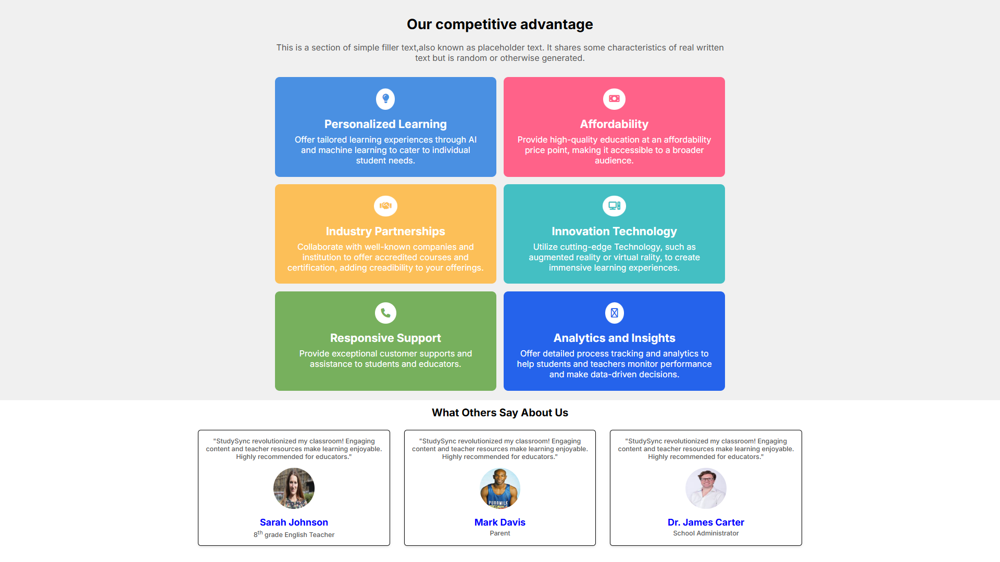
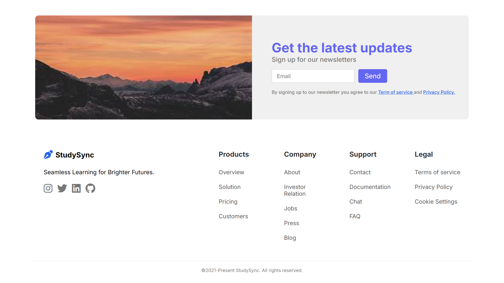

# 📚 StudySync

<p>
Seamless Learning for Brighter Futures — A modern platform designed to make learning simple, accessible, and engaging for everyone.
</p>

&nbsp;

---

## ✨ Features
| Feature | Description |
|---------|-------------|
| 🎯 **Personalized Learning** | AI and machine learning tailored experiences for individual student needs |
| 💰 **Affordability** | High-quality education at accessible price points |
| 🤝 **Industry Partnerships** | Accredited courses and certifications from renowned companies |
| 💻 **Innovation Technology** | Cutting-edge AR/VR for immersive learning experiences |
| 📞 **Responsive Support** | Exceptional customer support for students and educators |

---

## 🛠️ Tech Stack

&nbsp;

<p align="center">
  
  
  
</p>
&nbsp;


---


## 📸 Preview
&nbsp;
<p align="center">
  
  
  
</p>
&nbsp;

---


## 🚀 Getting Started

1. **Clone the repository**
   ```bash
   git clone https://github.com/yourusername/studysync.git
   ```

2. **Open in browser**
   ```bash
   cd studysync
   open StudySync.html
   ```

---

## 📁 Project Structure

```
babbar study sync/
├── StudySync.html    # Main HTML file
├── StudySync.css     # Stylesheet
└── README.md         # This file
```

---

## 🎨 Design Highlights

- **Responsive Design** — Works on mobile, tablet, and desktop
- **Modern Typography** — Inter font family
- **Smooth Animations** — Slide-in effects on load
- **Clean Color Palette**
  - Primary: `#6366F1` (Indigo)
  - Accent: `#3f83f8` (Blue)
  - Text: `#333333`


<p align="center">Made with ❤️ for learning purposes</p>
